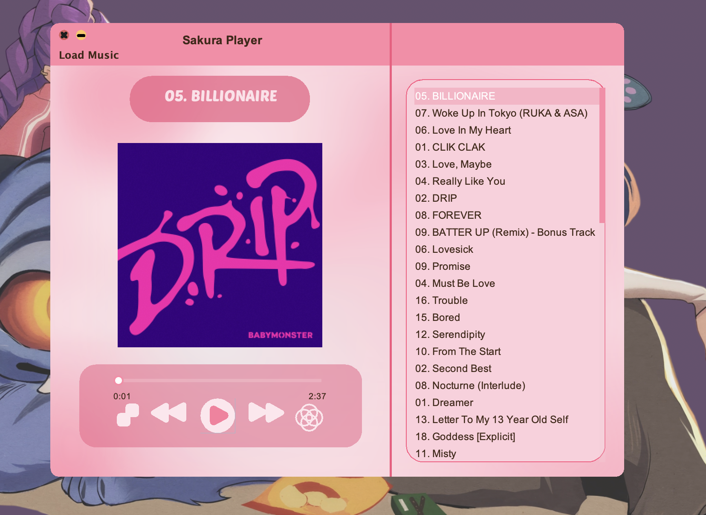

# SakuraPlayer 🎵



A beautiful music player built with **Java** and **JavaFX**, featuring a sleek custom UI and support for various audio formats.

## ✨ Features

- 🎶 Play MP3, WAV, FLAC, and other audio formats
- 🎨 Beautiful custom-designed UI with SVG graphics
- 📋 Song list management
- 🔄 Repeat and shuffle modes
- ⏪⏩ Next/Previous track navigation
- 📁 Load songs from your local files

## 📸 Screenshots


## 🚀 Download

Get the latest release from the [Releases page](https://github.com/ASeraphine/SakuraPlayer/releases).

### macOS
Download `Sakura.Player.dmg`, open it, and drag to Applications.

### Windows
Download `Sakura-Player-Windows.exe` and double-click to run.

### Cross-Platform (JAR)
Download `SakuraPlayer.jar` and run:
```bash
java --module-path "lib" --add-modules javafx.controls,javafx.media,javafx.swing,javafx.fxml,javafx.web,java.logging -jar SakuraPlayer.jar
```

## 🛠️ Building from Source

### Prerequisites
- Java 25+ (JDK)
- JavaFX 25 SDK

### Build
```bash
javac --module-path "lib" --add-modules javafx.controls,javafx.media,javafx.swing,javafx.fxml,javafx.web,java.logging -cp "lib/jaudiotagger-3.0.1.jar:lib/batik-all-1.19.jar:lib/svg-salamander-1.1.5.3.jar:lib/jlayer-1.0.1.jar:lib/mp3agic-0.9.0.jar:src" src/*.java -d bin
cd bin
jar cvfe ../SakuraPlayer.jar App *
cd ..
cd res
jar uf ../SakuraPlayer.jar .
cd ..
```

## 📁 Project Structure

```
SakuraPlayer/
├── src/           # Java source files
├── res/           # Resources (images, SVGs, icons)
├── lib/           # Dependencies (JavaFX, audio libraries)
├── build_mac_app.sh    # macOS build script
├── build_windows.bat   # Windows build script
└── launch4j.xml        # Windows EXE config
```

## 📦 Dependencies

- **JavaFX 25** - UI framework
- **JAudioTagger 3.0.1** - Audio metadata
- **SVG Salamander 1.1.5.3** - SVG processing
- **JLayer 1.0.1** - MP3 decoding
- **MP3agic 0.9.0** - MP3 metadata

## 📄 License

This project is licensed under the MIT License - see the [LICENSE](LICENSE) file for details.
